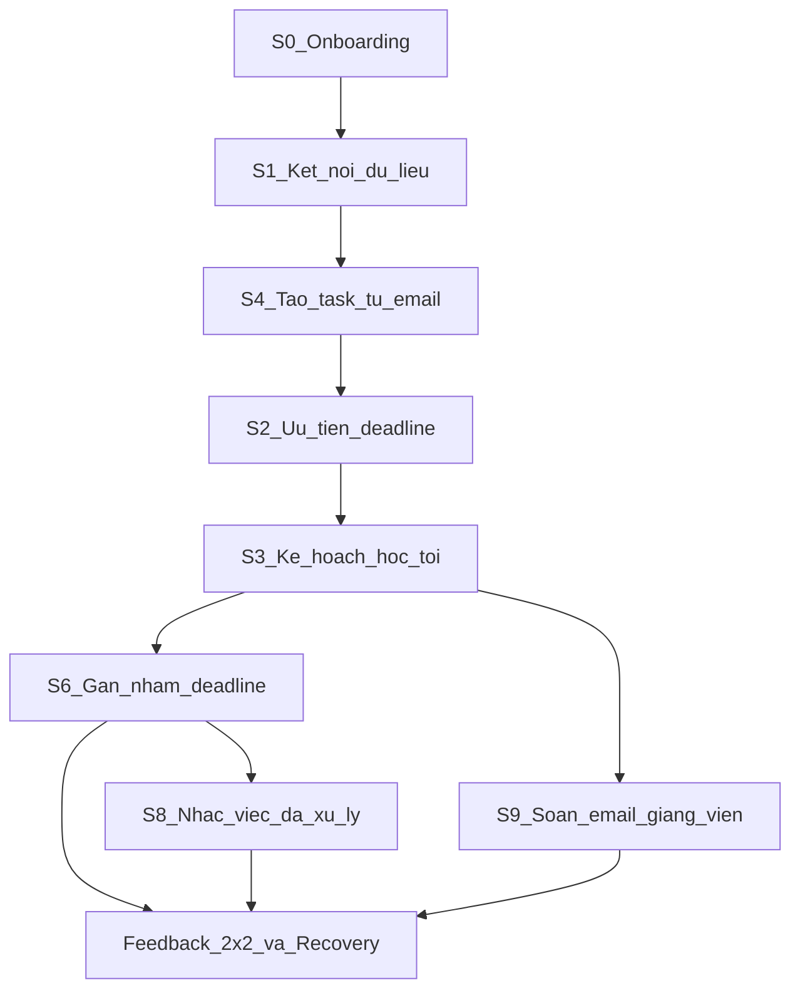

# Plan: Tasks tuần tự — AI Personal Assistant for Students

## Mục tiêu deliverable

Sau khi bạn xác nhận plan, tôi sẽ tạo **2 file mới**:

| File | Mục đích |
|------|----------|
| [`Human-Centered-AI-Design/TASKS.md`](Human-Centered-AI-Design/TASKS.md) | Checklist tasks tuần tự, timeline, checklist đạt, demo script |
| [`Human-Centered-AI-Design/PROMPTS.md`](Human-Centered-AI-Design/PROMPTS.md) | Bộ prompt copy-paste để dùng AI (Cursor, ChatGPT, v0, v.v.) tạo mockup/HTML clickable |

Cả hai ánh xạ từ [`day18-track1-lab.pdf`](Day_18/day18-track1-lab.pdf) sang track **AI Personal Assistant for Students**.

---

## Lát cắt tính năng đề xuất

Để đáp ứng yêu cầu "một lát cắt nhỏ nhưng xử lý kỹ" (không làm cả app), plan sẽ gắn mọi kịch bản vào **một luồng thống nhất**:

> **"AI đọc email trường → tạo nhiệm vụ học tập → sắp xếp ưu tiên tuần → nhắc việc & khôi phục khi sai"**

Lát cắt này nối được onboarding, tương tác, explainability, agency và recovery mà PDF yêu cầu.



---

## Bộ kịch bản đã chọn (đủ điều kiện PDF)

| # | Kịch bản | Loại | Vai trò trong prototype |
|---|----------|------|-------------------------|
| **S0** | First-time User Onboarding | Bắt buộc | Giai đoạn A |
| **S1** | Kết nối dữ liệu học tập | Trong tương tác | Quyền riêng tư + Ask |
| **S4** | Tạo nhiệm vụ từ email trường | Trong tương tác | Explainability + lớp bằng chứng |
| **S2** | Nhiều deadline trong tuần | Trong tương tác | Explainability + Act/Ask |
| **S6** | Gán nhầm deadline môn học | Sai sót & Khôi phục | Vòng recovery hoàn chỉnh |
| **S9** | Soạn email cho giảng viên | Agency | Don't Act / Ask rõ ranh giới |

*Ghi chú:* S3 (kế hoạch học tối nay) và S8 (nhắc việc đã xử lý) sẽ được đề cập trong file như **kịch bản dự phòng** nếu nhóm muốn thay S2 hoặc S6 — nhưng bộ 6 kịch bản trên đã vượt mức tối thiểu (1 + 4).

---

## Cấu trúc nội dung file `TASKS.md`

File markdown sẽ gồm các phần sau, mỗi task có checkbox `- [ ]`, thứ tự thực hiện và thời gian ước lượng (dựa trên timeline 120 phút trong PDF mục 15):

### Phase 0 — Chuẩn bị (trước khi prototype)
1. Xác nhận nhóm 3 người và phân vai (research, UI, rationale/demo)
2. Chốt persona sinh viên (năm học, môi trường: email trường + lịch học)
3. Viết 1 đoạn scope: user, pain point, lát cắt, out-of-scope
4. Chọn công cụ prototype (Figma / HTML clickable / Framer)
5. Tạo flow map tổng: Onboarding → During → After → Feedback

### Phase 1 — Onboarding (S0) ~15 phút
6. Thiết kế màn đầu: AI hỗ trợ gì / không làm gì / cần quyền gì
7. Thiết kế cách người dùng bắt đầu mà không phải form dài
8. Thiết kế kiểm soát: bỏ qua, thu hồi quyền, điều chỉnh sau
9. Viết design rationale cho S0 (10 câu hỏi PDF mục 7.2)

### Phase 2 — Luồng chính During (S1, S4, S2) ~35 phút
10. **S1:** Flow xin kết nối email/lịch — lợi ích, phạm vi dữ liệu, quyền kiểm soát (Ask)
11. **S4:** Flow đọc email → đề xuất task — hiển thị nguồn email, suy luận AI, nút chấp nhận/sửa/từ chối
12. **S2:** Flow ưu tiên deadline tuần — lớp bằng chứng (email nguồn, deadline, mức quan trọng), cho phép chỉnh tiêu chí
13. Thể hiện trạng thái AI: đang xử lý, hỏi thêm, đề xuất, tiến độ
14. Gán Act/Ask/Don't Act cho từng hành động trong 3 flow trên
15. Viết rationale cho S1, S4, S2

### Phase 3 — After action & Agency (S9) ~15 phút
16. Thiết kế màn review sau khi AI tạo task/ưu tiên: fact vs inference
17. **S9:** Flow soạn email nháp xin dời deadline — AI Don't Act gửi, Ask trước khi gửi, user chỉnh sửa
18. Thiết kế undo / từ chối / lưu nháp
19. Viết rationale cho S9 (rủi ro quan hệ giảng viên)

### Phase 4 — Failure & Recovery (S6) ~30 phút
20. **S6:** Kịch bản AI gán nhầm deadline môn A thay vì môn B
21. Thiết kế vòng lặp đầy đủ: phát hiện → phản hồi cụ thể (không chỉ dislike) → hệ thống xác nhận hiểu → đề xuất sửa → tiếp tục mục tiêu → nói rõ ghi nhớ gì
22. Thiết kế đường khôi phục: sửa môn, hoàn tác task, cập nhật ưu tiên
23. Viết rationale cho S6 (hậu quả nếu sai, khả năng phát hiện/hoàn tác)

### Phase 5 — Feedback hai chiều (ma trận 2×2) ~20 phút
24. **Explicit User → System:** màn báo sai loại lỗi + chọn lý do (gắn S6)
25. **Implicit User → System:** chú thích hành vi hoàn tác / sửa tay / bỏ dở (gắn S4, S6)
26. **Explicit System → User:** banner trạng thái, giới hạn, nguồn, bước tiếp theo
27. **Implicit System → User:** affordance UI (nút review nổi bật, draft vs sent, progressive disclosure)
28. Viết rationale cho cả 4 ô ma trận (8 câu hỏi PDF mục 9)

### Phase 6 — Tổ chức prototype & nộp bài ~15 phút
29. Sắp xếp prototype theo cấu trúc PDF mục 16:
    - `00` Flow map
    - `01` Onboarding
    - `02` Luồng chính
    - `03` After / Agency
    - `04` Failure & Recovery
    - `05` Feedback 2×2
    - `06` Design rationale
    - `07` Demo path
30. Nối các frame thành prototype clickable
31. Tạo demo path 5 phút (script theo PDF mục 17)
32. Kiểm tra checklist tối thiểu (PDF mục 19)
33. Cấp quyền xem link prototype + cập nhật README nếu cần

### Phase 7 — Demo & tự đánh giá
34. Tập demo 5 phút theo script
35. Tự chấm theo 5 tiêu chí: rationale 30%, failure 25%, agency 20%, feedback 15%, prototype 10%

---

## Checklist điều kiện đạt (sẽ embed trong TASKS.md)

- Onboarding lần đầu (S0)
- ≥ 4 kịch bản ngoài onboarding (S1, S4, S2, S6, S9 = 5)
- Vòng đời xuyên suốt: Onboarding → During → After → Feedback
- Đủ Act / Ask / Don't Act
- ≥ 1 vòng feedback + recovery hoàn chỉnh (S6)
- Đủ 4 loại feedback 2×2
- ≥ 1 lớp bằng chứng (S4 email nguồn, S2 tiêu chí ưu tiên)
- Rationale đặt cạnh mỗi flow quan trọng

---

## Mapping Act / Ask / Don't Act (sẽ ghi trong TASKS.md)

| Hành động | Mức | Lý do |
|-----------|-----|-------|
| Tự tạo nhắc nhở nhẹ / gợi ý thứ tự học | **Act** | Rủi ro thấp, dễ sửa |
| Kết nối email/lịch, tạo task từ email | **Ask** | Cần consent, tác động dữ liệu cá nhân |
| Gửi email cho giảng viên | **Don't Act** (chỉ soạn nháp) | Rủi ro cao, khó hoàn tác |

---

## Lỗi cần tránh (sẽ nhắc trong TASKS.md)

- Chỉ làm chatbot hỏi–đáp
- Nút "báo lỗi" mà không có recovery
- Cảnh báo "AI có thể sai" thay cho bằng chứng + quyền kiểm soát
- UI đẹp nhưng thiếu trạng thái và nhánh lỗi

---

## File `PROMPTS.md` — Cấu trúc & nội dung sẽ generate

File gồm **prompt hệ thống dùng chung** + **prompt từng màn hình** theo thứ tự demo. Mỗi prompt yêu cầu output HTML/CSS (hoặc React) clickable, có annotation rationale, đáp ứng Human-Centered AI Design.

### Quy ước trong mọi prompt

- Ngôn ngữ UI: **tiếng Việt**
- Persona: sinh viên đại học năm 2, dùng email trường `@student.university.edu`
- Tên app: **StudyMate AI**
- Style: mobile-first (375px), clean, accessible, không chatbot đơn thuần
- Mỗi màn có: trạng thái AI rõ, nút user control, sticky note rationale (góc phải, font nhỏ)
- Gắn nhãn: `[Act]` / `[Ask]` / `[Don't Act]` trên hành động AI tương ứng
- Dùng dữ liệu mẫu cố định (môn CS101, MATH201, email giảng viên Nguyễn Văn A)

### Danh sách prompt (theo thứ tự chạy)

| # | ID màn | Kịch bản | Prompt tóm tắt |
|---|--------|----------|----------------|
| 0 | `00-flow-map` | Tổng quan | Sơ đồ HTML clickable 4 giai đoạn + link tới các màn |
| 1 | `01-onboarding` | S0 | Welcome 3 bước: AI làm gì / không làm / quyền cần — không form dài |
| 2 | `01b-connect-data` | S1 | Modal xin kết nối email + lịch, phạm vi dữ liệu, nút Cho phép / Để sau |
| 3 | `02-email-scanning` | S4 (during) | Trạng thái "Đang đọc email..." + progress |
| 4 | `02-task-proposal` | S4 (after) | Card đề xuất task + panel bằng chứng (trích email) + Chấp nhận/Sửa/Từ chối |
| 5 | `02-week-priority` | S2 | Danh sách 4 deadline có explainability slider tiêu chí ưu tiên |
| 6 | `03-review-facts` | After | Màn review: fact vs inference, undo |
| 7 | `03-draft-email` | S9 | Soạn email nháp xin dời deadline — Don't Act gửi, chỉ Ask |
| 8 | `04-wrong-deadline` | S6 | Task gán nhầm môn A→B, user phát hiện |
| 9 | `04-error-feedback` | S6 + feedback | Form báo sai loại lỗi (explicit user feedback) |
| 10 | `04-recovery` | S6 | Hệ thống xác nhận hiểu + đề xuất sửa + cập nhật ưu tiên |
| 11 | `05-feedback-matrix` | Feedback 2×2 | Trang tổng hợp 4 ô ma trận + ví dụ trên UI |
| 12 | `06-rationale` | Rationale | Trang design decisions chính |
| 13 | `07-demo-path` | Demo | Index nối tất cả màn theo script 5 phút |

### Prompt master (dùng đầu file PROMPTS.md)

```
Bạn là UI/UX designer + front-end dev. Tạo prototype HTML/CSS clickable cho bài lab
"Human-Centered AI Design" — AI Personal Assistant for Students.

Lát cắt: AI đọc email trường → tạo nhiệm vụ → sắp xếp ưu tiên tuần → khôi phục khi sai.

Yêu cầu bắt buộc mọi màn hình:
- Tiếng Việt, mobile-first 375px, tên app StudyMate AI
- KHÔNG chỉ là chatbot; phải có trạng thái AI, quyền kiểm soát, recovery path
- Mỗi màn có sticky rationale note (góc phải) trả lời: AI biết gì/chưa biết, rủi ro, Act/Ask/Don't Act
- Dùng dữ liệu mẫu: CS101, MATH201, deadline 25/06, email từ thầy Nguyễn Văn A
- Output: 1 file HTML self-contained, inline CSS, nút điều hướng sang màn tiếp theo (dùng data-next="...")
- Không cần backend/API thật; dùng nội dung giả lập có sẵn
```

### Prompt mẫu — S0 Onboarding (`01-onboarding`)

```
[Tiếp tục từ master prompt]

Tạo màn hình S0 — First-time Onboarding cho StudyMate AI.

Bối cảnh: Sinh viên lần đầu mở app, chưa biết AI quản lý deadline/email được tới đâu.

UI cần có (3 bước swipe hoặc 3 card):
1. "AI có thể giúp": đọc email trường, tạo task, gợi ý ưu tiên, soạn email nháp
2. "AI không tự làm": gửi email thay bạn, nộp bài, đăng ký môn
3. "Bắt đầu": nút "Kết nối dữ liệu" (→ 01b) và "Khám phá trước" (skip)

Trạng thái AI: "Chưa có dữ liệu học tập"
Agency: [Ask] cho mọi kết nối dữ liệu

Rationale note phải giải thích: vì sao không dùng form dài ngay đầu.

Nút cuối: "Tiếp tục" → data-next="01b-connect-data"
```

### Prompt mẫu — S4 Task từ email (`02-task-proposal`)

```
[Tiếp tục từ master prompt]

Tạo màn hình S4 — AI đề xuất tạo nhiệm vụ từ email trường.

Bối cảnh: AI vừa đọc email tiêu đề "[CS101] Nộp bài tập 3 trước 25/06" nhưng email
có thể thuộc môn khác hoặc chỉ là thông báo chung.

UI:
- Card đề xuất task: "Nộp Bài tập 3 — CS101 — Deadline 25/06"
- Panel "Bằng chứng" (expandable): trích 2 dòng email nguồn + ngày nhận
- Badge "Suy luận AI" vs "Từ email" phân biệt fact/inference
- Nút: Chấp nhận [Ask], Sửa, Từ chối
- Banner hệ thống [Explicit System Feedback]: "AI đề xuất — chưa lưu vào lịch"

Implicit system cue: nút "Xem nguồn email" nổi bật hơn nút Chấp nhận.

Rationale: email có thể nhầm môn → cần review trước khi Act.

Nút Chấp nhận → data-next="02-week-priority"
Nút Sửa → mở inline edit môn/deadline
```

### Prompt mẫu — S6 Recovery (`04-recovery`)

```
[Tiếp tục từ master prompt]

Tạo màn hình S6 — Recovery sau khi gán nhầm deadline.

Bối cảnh: User đã báo "Sai môn học" — email thực ra về MATH201 không phải CS101.

UI flow hoàn chỉnh trên 1 màn (hoặc 2 step):
1. Hệ thống xác nhận: "Mình hiểu: deadline này thuộc MATH201, không phải CS101"
2. Đề xuất khôi phục: di chuyển task, cập nhật ưu tiên tuần
3. Checkbox "Ghi nhớ: email từ thầy B thường là MATH201"
4. Nút Hoàn tất → quay lại 02-week-priority đã sửa

Explicit user feedback đã xảy ra ở màn trước (04-error-feedback).
Phải thể hiện user TIẾP TỤC hoàn thành mục tiêu, không dừng ở "đã ghi nhận lỗi".

Rationale: hậu quả nếu sai = học nhầm môn, bỏ lỡ deadline thật.
```

### Prompt nối prototype (`prompt-stitch`)

```
[Tiếp tục từ master prompt]

Tôi đã có các file HTML riêng lẻ. Hãy tạo file index.html (07-demo-path) nối tất cả màn
theo demo script 5 phút:

0:00 — Flow map (00)
0:30 — Onboarding (01 → 01b)
1:15 — Email → Task → Priority (02-*)
2:15 — Wrong deadline → Error feedback → Recovery (04-*)
3:45 — Feedback matrix (05)
4:45 — Rationale highlights (06)

Yêu cầu:
- Sidebar hoặc bottom nav chỉ hiện trong demo mode
- Mỗi màn giữ rationale sticky note
- Thêm nút "Demo tiếp theo" theo script
- Single-page app với show/hide sections HOẶC multi-page với links — tùy đơn giản hơn
```

### Thứ tự sử dụng prompt (ghi trong PROMPTS.md)

1. Chạy **Master prompt** một lần để AI hiểu context
2. Chạy lần lượt prompt `00` → `07` (mỗi lần 1 màn)
3. Chạy **prompt-stitch** để nối thành demo path
4. Review checklist PDF; bổ sung prompt chỉnh sửa nếu thiếu Act/Ask/Don't Act hoặc ô feedback

### Prompt chỉnh sửa nhanh (cuối file)

- "Thêm trạng thái loading khi AI đọc email, có thanh tiến độ và text 'Đang phân tích 2/5 email'"
- "Làm nổi bật hơn sự khác biệt fact vs inference trên màn 02-task-proposal"
- "Thêm implicit user feedback annotation: khi user hoàn tác, hiện tooltip 'Hệ thống ghi nhận: có thể đề xuất chưa phù hợp'"

---

## Việc thực hiện sau khi bạn approve

1. Tạo [`Human-Centered-AI-Design/TASKS.md`](Human-Centered-AI-Design/TASKS.md) — checklist tuần tự
2. Tạo [`Human-Centered-AI-Design/PROMPTS.md`](Human-Centered-AI-Design/PROMPTS.md) — toàn bộ prompt copy-paste (master + 13 màn + stitch + prompt chỉnh sửa)
3. Không sửa [`README.md`](Human-Centered-AI-Design/README.md) trừ khi bạn yêu cầu thêm link
